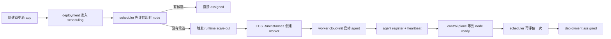

# 03 阿里云应用触发运行时扩容

这一章把
`mini-cloud v3`
真正往前推了一步：

- `Terraform + cloud-init`
  已经能把 control-plane 装起来
- 但如果平台里一台可调度 worker 都没有
  创建或更新应用还是会直接失败

所以这一章要解决的问题是：

- 创建或更新应用时
- 如果 scheduler 找不到可用 worker
- control-plane 不要立刻判失败
- 而是先去阿里云创建一台新的 worker
- 等它自己注册回平台
- 再重新调度一次

这就是这一章的核心闭环。

## 这一章解决了什么

做完以后，
当前阿里云单 provider 这条链会变成：

1. `Terraform apply`
   把平台主机拉起来
2. 平台主机上的 `cloud-init`
   安装：
   - `control-plane`
   - `agent`
   - `provider binding`
   - `runtime profile`
3. 你创建或更新一个应用
4. scheduler 先看当前有没有 ready worker
5. 如果没有
   - control-plane 通过阿里云 `ECS SDK`
     调 `RunInstances`
     创建一台 worker
6. 新 worker 开机后执行自己的 `cloud-init`
   - 安装 `docker`
   - 从 control-plane 内网地址下载 `agent`
   - 启动 `mini-cloud agent`
7. agent 自动：
   - `register`
   - `heartbeat`
8. control-plane 等到这台 node 变成：
   - `ready`
   - `schedulable`
9. scheduler 再评估一次
10. deployment 进入：
    - `assigned`

## 为什么不能直接让 worker 用 OSS 签名链接下载 agent

这里有一个非常关键的设计点。

`02`
里平台主机安装程序时，
我们把二进制上传到 `OSS`，
再给 `cloud-init`
一个临时签名下载链接。

这个做法对 control-plane 首装是成立的，
因为：

- `terraform apply`
  之后实例很快就会启动
- 签名链接在短时间内通常还有效

但 runtime worker 不是这样。

运行时扩容的 worker 可能发生在：

- 平台已经跑起来很久以后
- 你过了几十分钟甚至几小时以后
- 某次新的应用更新触发调度不足时

如果还把那个“会过期的签名链接”写进 runtime 配置，
那新 worker 很可能拿到的是：

- 已经过期的下载地址

这样扩容会失败得非常隐蔽。

所以这一章改成：

- 平台主机在首装时自己也下载并保存一份：
  - `agent`
- control-plane 通过固定路由暴露这个本地文件：
  - `/internal/artifacts/agent-linux-amd64`
- 后续 runtime worker 不再依赖旧的 `OSS` 签名链接
- 而是改成从平台内网地址下载 agent

也就是说：

- `OSS 签名 URL`
  只负责“把程序送进平台主机”
- 平台主机再负责“把 agent 分发给后续新 worker”

## 这一章多了哪两份平台运行时配置

当前平台启动后，
磁盘上会同时有两份和 provider 相关的文件：

1. `/opt/mini-cloud/provider-binding.json`
   - 表达：
   - 这套 control-plane 绑定到了哪家云
2. `/opt/mini-cloud/provider-runtime-profile.json`
   - 表达：
   - 这套 control-plane 以后如果要临时创建 worker
   - 应该用哪套运行时参数

可以这样区分：

- `provider binding`
  更像“平台身份”
- `runtime profile`
  更像“运行时扩容模板”

当前 runtime profile 里会保存这些最关键的字段：

- provider
- region / zone
- control-plane 内网地址
- worker 默认实例规格
- worker 镜像
- key pair
- vSwitch / security group
- system disk
- docker registry mirror
- agent artifact 地址
- heartbeat / work interval

control-plane 会通过：

- `MINICLOUD_PROVIDER_RUNTIME_PROFILE_PATH`

在启动时把这份配置读进来，
然后构造：

- `WorkerProvisioner`

## 调度链路现在怎么变了

之前应用创建或更新触发调度时，
逻辑大概是：

```text
create deployment
-> scheduling
-> scheduler.Evaluate(...)
-> 没有候选节点
-> deployment failed
```

这一章改成：



对应的代码位置在：

- [app_handler.go](/home/what/myproject/swe-tools-learn-etcd/projects/mini-cloud/internal/cloudplane/api/app_handler.go)
- [app_scale_out.go](/home/what/myproject/swe-tools-learn-etcd/projects/mini-cloud/internal/cloudplane/api/app_scale_out.go)

现在的策略是：

- 只有第一次调度找不到候选节点时
  才尝试扩容
- 如果当前发布是“必须继续留在旧 active node 上”的安全切流场景
  就不会触发扩容
- 扩容成功后
  control-plane 会等待新 worker 注册成：
  - `ready`
  - `schedulable`
- 然后重新执行一次：
  - `scheduler.Evaluate(...)`

## agent 运行 workload 时为什么也改成了 Docker SDK

这一章还有一个实现层面的收口：

- agent 执行 workload 时
  不再通过：
  - `docker run`
  - `docker logs`
  - `docker stop`
  这些 CLI 子进程去驱动容器
- 而是改成直接通过：
  - Docker Engine SDK
  - 连本机 Docker socket

对应文件在：

- [runtime.go](/home/what/myproject/swe-tools-learn-etcd/projects/mini-cloud/internal/cloudworker/runtime/runtime.go)
- [docker_engine.go](/home/what/myproject/swe-tools-learn-etcd/projects/mini-cloud/internal/cloudworker/runtime/docker_engine.go)

这样做的意义很直接：

- 不再依赖 shell 命令输出格式
- `run / inspect / logs / stop`
  都走同一套 API
- 后面如果要补：
  - 更细的错误分类
  - 更稳定的状态判断
  - 容器元数据回读
  也更自然

也就是说，
这一章的“运行时扩容”
现在已经同时收口了两层运行时主链：

- 云上建 worker
  - 走阿里云 `SDK`
- worker 上跑容器
  - 走 Docker Engine `SDK`

## 阿里云 worker provisioner 现在做了什么

新加的实现放在：

- [aliyun.go](/home/what/myproject/swe-tools-learn-etcd/projects/mini-cloud/internal/cloudworker/runtimeprovision/aliyun.go)

它当前做了四件事：

1. 读取 runtime profile
2. 调：
   - `DescribeInstanceTypes`
   查询配置里那种实例规格的 CPU / 内存容量
3. 如果应用请求量已经大于这台实例的容量
   - 直接返回明确错误
4. 调：
   - `RunInstances`
   创建一台新的 worker

这里有两个容易忽略的细节。

### 1. 这里还会校验“这个 worker 规格够不够装下应用”

例如应用想要：

- `1500m CPU`
- `1536Mi memory`

而 runtime profile 配的 worker 规格只有：

- `1000m CPU`
- `1024Mi memory`

那这次扩容就算真的去建机，
最后也还是调度不上。

所以 provisioner 会先根据：

- `DescribeInstanceTypes`

把实例规格翻译成平台内部使用的：

- `cpuMilli`
- `memoryMi`

然后先判断能不能装下。

### 2. 这里给 runtime worker 开了最小公网出带宽

当前实验环境里，
runtime worker 和 platform 都在同一个 `VPC / vSwitch`。

但我们还没有在这条实验链里专门搭：

- `NAT Gateway`

这就意味着：

- 新 worker 如果完全没有公网出能力
- 它就很难自己：
  - `apt-get update`
  - 安装 `docker.io`
  - 拉业务镜像

所以当前 `RunInstances`
里会给 runtime worker 打开一个非常小的公网出带宽：

- `InternetMaxBandwidthOut = 1`

它不是为了暴露服务给公网，
而是为了让这条教学链在“还没讲 NAT”的前提下先跑通。

后面如果做得更正式，
更合理的方案会是：

- 私网 worker + NAT / 私有镜像分发

### 3. 这里已经顺手给 runtime worker 打了可回收标签

虽然这一章还没正式实现：

- worker 回收
- 空闲 worker 清理

但当前 `RunInstances`
创建出来的 worker
已经会打这些标签：

- `managed-by=mini-cloud`
- `mini-cloud/platform=<platform-name>`
- `mini-cloud/role=worker`
- `mini-cloud/app-id=<app-id>`
- `mini-cloud/deployment-id=<deployment-id>`

对应代码在：

- [aliyun.go](/home/what/myproject/swe-tools-learn-etcd/projects/mini-cloud/internal/cloudworker/runtimeprovision/aliyun.go)

这样后面做：

- runtime inventory
- runtime reclaim / gc

时，就不会从零开始补资源识别规则。

## 新 worker 的 cloud-init 现在会做什么

这一章不只是 platform 主机会跑 `cloud-init`，
新建出来的 runtime worker 也会带一份自己的 `userData`。

它的大致流程是：

1. 从阿里云实例元数据拿到：
   - `instance-id`
   - `private-ipv4`
   - `public-ipv4`
2. 安装：
   - `docker.io`
   - `curl`
3. 配置 Docker 镜像加速
4. 从 control-plane 内网地址下载：
   - `agent`
5. 写入：
   - `mini-cloud-agent.service`
6. 启动 agent

这个 agent 之后就会进入我们前面已经做好的 managed loop：

- register
- heartbeat
- poll work
- report execution

所以这章没有发明第二套 node 生命周期，
而是把“怎么把一台新 ECS 拉进现有 agent 主链里”补齐了。

## 为什么安全组现在要放开 worker 子网到 control-plane 8080

这一章还有一个非常容易被忽略的基础设施变化。

现在 runtime worker 要访问 control-plane 的：

- `/api/v1/nodes/register`
- `/api/v1/nodes/{id}/heartbeat`
- `/internal/artifacts/agent-linux-amd64`

这些都在 platform 主机的：

- `8080`

如果安全组只允许“管理员自己的 CIDR”访问 `8080`，
那 worker 根本拿不到 agent，
也无法注册回平台。

所以当前 Terraform 里额外加了一条内网规则：

- 允许 worker 所在子网访问 control-plane `8080`

对应文件在：

- [network-base/main.tf](/home/what/myproject/swe-tools-learn-etcd/projects/mini-cloud/deploy/terraform/providers/aliyun/modules/network-base/main.tf)

这里的取舍是：

- 这是实验平台内网
- node 注册接口当前也还是平台内网信任模型

所以先把链路跑通，
更严格的零信任 / 双向校验
留给后面版本。

## 发布脚本为什么也变了

当前用于发布制品的脚本还是：

- [publish-control-plane-to-oss.sh](/home/what/myproject/swe-tools-learn-etcd/projects/mini-cloud/scripts/publish-control-plane-to-oss.sh)

但它现在不再只上传：

- `control-plane`

而是会同时上传：

- `control-plane`
- `agent`

并生成本地：

- `terraform.binary.auto.tfvars.json`

这个本地文件现在会带上四个字段：

- `control_plane_binary_url`
- `control_plane_binary_sha256`
- `agent_binary_url`
- `agent_binary_sha256`

这样 platform 主机首装时，
就能把：

- `control-plane`
- `agent`

一起下载到本机磁盘。

## Terraform 侧现在多了什么

这一章的 Terraform 侧主要补了三件事。

### 1. platform cloud-init 会把 agent 一起装到本机

对应文件：

- [user-data.sh.tftpl](/home/what/myproject/swe-tools-learn-etcd/projects/mini-cloud/deploy/terraform/providers/aliyun/templates/user-data.sh.tftpl)

现在会下载并保存：

- `/opt/mini-cloud/bin/control-plane`
- `/opt/mini-cloud/bin/agent`

### 2. platform cloud-init 会额外写 runtime profile

当前运行时配置文件路径是：

- `/opt/mini-cloud/provider-runtime-profile.json`

control-plane 启动时会通过环境变量读取它。

### 3. lab 变量里增加了 runtime worker 的可选参数

对应文件：

- [variables.tf](/home/what/myproject/swe-tools-learn-etcd/projects/mini-cloud/deploy/terraform/lab/variables.tf)
- [terraform.tfvars.example](/home/what/myproject/swe-tools-learn-etcd/projects/mini-cloud/deploy/terraform/lab/terraform.tfvars.example)

当前支持显式覆盖：

- runtime worker 实例规格
- runtime worker 镜像
- runtime worker key pair
- runtime worker system disk
- heartbeat / work interval

如果你不填，
默认会尽量复用 platform 当前那套参数。

## 现在本地代码怎么验证

这一章当前至少有一条新的集成测试：

- [httpapi_integration_test.go](/home/what/myproject/swe-tools-learn-etcd/projects/mini-cloud/internal/cloudplane/api/httpapi_integration_test.go)

它验证的是：

- 当前没有 ready worker
- 创建或更新 app
- fake provisioner 被触发
- fake worker 注册并 heartbeat
- deployment 最终不是 `failed`
- 而是 `assigned`

本地快速检查命令还是：

```bash
cd projects/mini-cloud
./scripts/check.sh
```

## 真实实验怎么走

当前真实实验建议按下面顺序。

### 1. 先发布 control-plane 和 agent 二进制

```bash
cd projects/mini-cloud
./scripts/publish-control-plane-to-oss.sh --bucket <your-bucket>
```

这一步会生成本地：

- `deploy/terraform/lab/terraform.binary.auto.tfvars.json`

### 2. 准备 Terraform 变量

至少把：

- `deploy/terraform/lab/terraform.tfvars`

里的这些值填好：

- `provider_name`
- `platform_name`
- `aliyun.region_id`
- `aliyun.zone_id`
- `aliyun.image_id`
- `ssh_public_key_path`

如果你不打算给 runtime worker 单独指定参数，
那它默认会复用 platform 的：

- `aliyun.instance_type`
- `aliyun.image_id`
- 同一把自动导入的 `SSH` 登录密钥

这里的 `admin_token`
默认也是自动生成的。
需要时直接：

```bash
terraform output -raw admin_token
```

回读即可。

### 3. 创建平台

```bash
cd projects/mini-cloud/deploy/terraform/lab
terraform init
terraform apply
```

### 4. 确认平台已经写好 binding 和 runtime profile

可以先看两个 API：

- `/api/v1/platform/provider-binding`
- `/api/v1/platform/runtime-profile`

### 5. 提交一个没有现成 worker 可用的应用

如果这章链路正常，
你会看到：

1. app 创建或更新时不会直接失败
2. 阿里云里会多出一台新的 worker ECS
3. 平台节点列表里会出现新的 ready worker
4. deployment 进入：
   - `assigned`

## 当前边界

这一章故意还没做下面这些事：

- worker 回收
- runtime inventory
- 空闲 worker TTL
- worker 创建失败后的重试队列
- 多 worker 批量扩容
- 更严格的 node 注册鉴权
- 私网 NAT / 私有镜像仓库

这里要特别把 `Terraform` 的边界说清楚：

- `terraform apply`
  只负责创建平台自己的 bootstrap 底座
- 这一章里额外创建出来的 runtime worker
  是 control-plane 在运行时通过阿里云 `ECS SDK`
  调 `RunInstances`
  直接创建的
- 所以当前直接执行：
  - `terraform destroy`
  只能回收 Terraform state 里那批平台资源
- 它不会自动知道“平台后来又通过 SDK 临时申请过哪些 worker”

也就是说，
当前真实环境如果已经触发过运行时扩容，
正确理解应该是：

- 平台底座回收
  - `terraform destroy`
- 运行时 worker 回收
  - 需要 platform 自己的 inventory / reclaim / teardown 流程

这一块会在：

- `04-aliyun-runtime-retry-and-reclaim`

里补完整，包括：

- runtime worker inventory
- 单 worker reclaim
- platform teardown
- `terraform destroy`
  前自动清场

因为这章的目标就是只把这一条先跑通：

- `创建或更新应用`
- `容量不足`
- `自动建 worker`
- `worker 注册`
- `重新调度成功`

worker 回收会留到：

- `04-aliyun-runtime-retry-and-reclaim`

## 本章涉及的核心文件

- [app_handler.go](/home/what/myproject/swe-tools-learn-etcd/projects/mini-cloud/internal/cloudplane/api/app_handler.go)
- [app_scale_out.go](/home/what/myproject/swe-tools-learn-etcd/projects/mini-cloud/internal/cloudplane/api/app_scale_out.go)
- [runtimeprovision.go](/home/what/myproject/swe-tools-learn-etcd/projects/mini-cloud/internal/cloudworker/runtimeprovision/runtimeprovision.go)
- [aliyun.go](/home/what/myproject/swe-tools-learn-etcd/projects/mini-cloud/internal/cloudworker/runtimeprovision/aliyun.go)
- [runtimeprofile.go](/home/what/myproject/swe-tools-learn-etcd/projects/mini-cloud/internal/cloudworker/runtimeprofile/runtimeprofile.go)
- [router.go](/home/what/myproject/swe-tools-learn-etcd/projects/mini-cloud/internal/cloudplane/api/router.go)
- [user-data.sh.tftpl](/home/what/myproject/swe-tools-learn-etcd/projects/mini-cloud/deploy/terraform/providers/aliyun/templates/user-data.sh.tftpl)
- [variables.tf](/home/what/myproject/swe-tools-learn-etcd/projects/mini-cloud/deploy/terraform/lab/variables.tf)
- [outputs.tf](/home/what/myproject/swe-tools-learn-etcd/projects/mini-cloud/deploy/terraform/lab/outputs.tf)
- [main.tf](/home/what/myproject/swe-tools-learn-etcd/projects/mini-cloud/deploy/terraform/providers/aliyun/modules/network-base/main.tf)
- [publish-control-plane-to-oss.sh](/home/what/myproject/swe-tools-learn-etcd/projects/mini-cloud/scripts/publish-control-plane-to-oss.sh)

## 本章检查点

- `v3/03`
  - `216d1f30b29fc7a0da26508495e2f1901ae2d78d`
