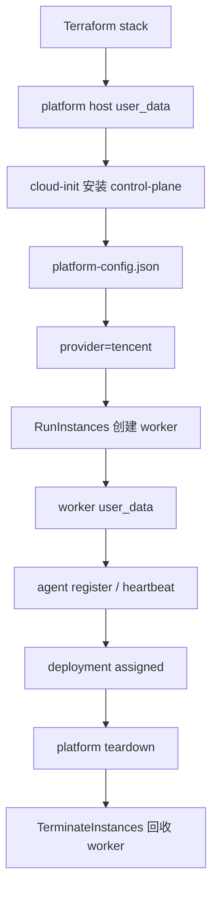
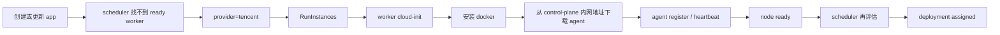

# 08 腾讯云 Control-Plane 安装与运行时扩容

`07`
先证明了：

- 腾讯云这边的 Terraform 平台底座
  已经能按 `05`
  收出来的目录结构落地

但那时还没证明更关键的两件事：

1. 这台腾讯云 platform host
   能不能真的首启装起：
   - `Postgres`
   - `control-plane`
   - `agent`
2. 平台跑起来以后
   能不能继续按同一份 provider contract
   通过腾讯云 `SDK`
   动态创建和回收 worker

这一章就是把这两件事补齐。

## 上一章检查点

- `v3/07`
  - `7bdae26df08d009648c31e5eac13272d9c9f357a`

## 这一章的官方依据

- 腾讯云实例自定义数据：
  - https://cloud.tencent.com/document/product/213/17525
- 腾讯云实例元数据：
  - https://cloud.tencent.com/document/product/213/4934
- 腾讯云实例角色：
  - https://cloud.tencent.com/document/product/213/47668
- 腾讯云 CVM `RunInstances`：
  - https://cloud.tencent.com/document/product/213/15730
- 腾讯云 CVM `DescribeInstanceTypeConfigs`：
  - https://cloud.tencent.com/document/product/213/31516
- 腾讯云 CVM `TerminateInstances`：
  - https://cloud.tencent.com/document/product/213/15723
- 腾讯云 Go SDK 官方仓库：
  - https://github.com/TencentCloud/tencentcloud-sdk-go

## 这一章解决了什么

做完以后，
腾讯云这条线会从：

- `07`
  只有：
  - `VPC`
  - `subnet`
  - `security group`
  - `platform CVM`
  - `EIP`

变成：

1. `Terraform apply`
   建出腾讯云平台底座
2. platform host 首次启动时
   通过 `cloud-init`
   自动安装：
   - `Docker`
   - `Postgres`
   - `control-plane`
   - `agent`
3. `cloud-init`
   直接写出：
   - `platform-config.json`
4. control-plane 启动后
   绑定 provider：
   - `tencent`
5. 创建或更新应用时如果没有 ready worker
   control-plane 通过腾讯云 `SDK`
   调：
   - `RunInstances`
   创建新的 worker
6. 新 worker 开机后
   用自己的 `cloud-init`
   安装并启动 `agent`
7. `agent`
   自动注册回来
8. scheduler 重新调度
9. `Terraform destroy`
   之前先走平台 teardown
   让 control-plane 自己回收 runtime worker

## 先看这章真正补了哪三层



这里要注意：

- `07`
  只做到：
  - `A`
- `08`
  才把：
  - `B -> K`
  这一整条主链补上

## 平台主机为什么要绑定实例角色

这一章里，
腾讯云平台主机会真的去调用腾讯云 `SDK`。

也就是说，
control-plane 进程所在的那台 `CVM`
必须在实例内拿到临时凭证。

当前实现选择的是：

- 通过腾讯云实例角色
  给 platform host 注入权限
- Go 代码里直接走腾讯云 SDK 官方提供的：
  - `DefaultProviderChain`

对应代码在：

- [provisioner.go](/home/what/myproject/swe-tools-learn-etcd/projects/mini-cloud/internal/provider/tencent/provisioner.go)

这里故意没有把长期 `SecretId / SecretKey`
塞进 `platform-config.json`。

原因很直接：

- 这台机器本来就是云上的 control-plane
- 最自然也更安全的做法
  就是：
  - 给实例绑角色
  - 实例内走临时凭证

这套实现里：

- `07`
  的 Terraform module 直接自动创建 `CAM` 实例角色
- 同时自动把它绑定到 platform host
- `08`
  只继续利用这份实例角色去跑：
  - control-plane 安装
  - 腾讯云 SDK 调用

这一章的边界是：

- Terraform 负责把角色自动建好并绑定到 platform host
- control-plane 再用这份实例角色去调腾讯云 `SDK`

也就是说，
这章解决的是：

- “平台怎么消费腾讯云实例角色”

而不是：

- “用户先手工准备角色名，再把它抄进 tfvars”

## stack 现在多了什么

关键文件在：

- [main.tf](/home/what/myproject/swe-tools-learn-etcd/projects/mini-cloud/deploy/terraform/lab/main.tf)
- [variables.tf](/home/what/myproject/swe-tools-learn-etcd/projects/mini-cloud/deploy/terraform/lab/variables.tf)
- [outputs.tf](/home/what/myproject/swe-tools-learn-etcd/projects/mini-cloud/deploy/terraform/lab/outputs.tf)
- [user-data.sh.tftpl](/home/what/myproject/swe-tools-learn-etcd/projects/mini-cloud/deploy/terraform/providers/tencent/templates/user-data.sh.tftpl)
- [destroy-runtime-cleanup.sh](/home/what/myproject/swe-tools-learn-etcd/projects/mini-cloud/deploy/terraform/lab/destroy-runtime-cleanup.sh)

这次不是只在 stack 里加几个变量，
而是把腾讯云版 stack 补成了和阿里云版同一层级的正式入口。

### 1. stack 现在自己生成 `platform_config_json`

`07`
里腾讯云 stack
还只是把底座资源输出出来。

现在它会直接生成一份统一的：

- `platform-config.json`

逻辑来源是：

- `platform`
- `provider`
- `network`
- `workerDefaults`
- `providerRuntimeSpec`

其中腾讯云这边真正关键的是：

```json
{
  "provider": {
    "name": "tencent",
    "regionId": "ap-beijing",
    "zoneId": "ap-beijing-6"
  },
  "providerRuntimeSpec": {
    "instanceType": "S5.MEDIUM4",
    "imageId": "img-xxxx",
    "keyIds": ["skey-xxxx"],
    "vpcId": "vpc-xxxx",
    "subnetId": "subnet-xxxx",
    "securityGroupIds": ["sg-xxxx"],
    "systemDiskType": "CLOUD_PREMIUM",
    "systemDiskSizeGiB": 50,
    "publicIpAssigned": true,
    "internetChargeType": "TRAFFIC_POSTPAID_BY_HOUR",
    "internetMaxBandwidthOutMbit": 1,
    "dockerRegistryMirror": "https://mirror.ccs.tencentyun.com"
  }
}
```

这就是腾讯云版 runtime contract 的核心。

### 2. stack 现在直接把 `cloud-init` 模板接进 `platform-host`

`07`
只是给 module 预留了：

- `user_data`

但没有真的把 control-plane 装进去。

现在 `08`
里，
stack 会直接：

- `templatefile(...)`
  渲染 `user-data.sh.tftpl`
- 把下面这些值传进去：
  - `control_plane_binary_url`
  - `control_plane_binary_sha256`
  - `agent_binary_url`
  - `agent_binary_sha256`
  - `admin_token`
  - `docker_registry_mirror`
  - `platform_config_json`

这里的 `admin_token`
默认不是手填的，
而是 root 自动生成后再传给 `cloud-init`。

也就是说，
从这一章开始，
腾讯云 stack 已经不再是“只有底座”，
而是：

- 底座 + control-plane 首启安装

### 3. destroy 前现在会先请求平台 teardown

这一点也很关键。

如果 control-plane 已经在腾讯云上动态创建出 worker，
那只做：

- `terraform destroy`

是不够的，
因为 Terraform state 里只有“平台自己的底座”，
没有运行时 worker。

所以这章和阿里云一样，
在 stack 里加了：

- `terraform_data.platform_runtime_cleanup`

它会在 destroy 时先调用：

- `/api/v1/platform/teardown`

然后再销毁 platform host、EIP、子网这些 Terraform 资源。

## 腾讯云版 `cloud-init` 现在到底做什么

platform host 的首启脚本在：

- [user-data.sh.tftpl](/home/what/myproject/swe-tools-learn-etcd/projects/mini-cloud/deploy/terraform/providers/tencent/templates/user-data.sh.tftpl)

这份脚本的流程是：

1. 通过腾讯云元数据拿到：
   - `local-ipv4`
2. 安装：
   - `docker.io`
   - `curl`
   - `ca-certificates`
   - `python3`
3. 拉起本机：
   - `Postgres 17`
   容器
4. 下载并校验：
   - `control-plane`
   - `agent`
5. 写出：
   - `platform-config.json`
   - `control-plane.env`
6. 写：
   - `mini-cloud-control-plane.service`
7. 等：
   - `/api/healthz`
   本机返回正常

这里和阿里云版很像，
但有两个腾讯云自己的点。

### 1. 元数据地址换成了腾讯云的

腾讯云这边现在走的是：

- `http://metadata.tencentyun.com/latest/meta-data`

当前脚本里直接用它读取：

- `local-ipv4`

worker 版脚本还会继续读：

- `instance-id`
- `public-ipv4`

### 2. `controlPlane.internalBaseURL` 还是由实例自己在首启时写

Terraform 在渲染模板时，
还不知道这台实例最终拿到的私网 IP。

所以和阿里云一样，
这里不是 Terraform 直接硬编码：

- `controlPlane.internalBaseURL`

而是等实例自己启动后，
用元数据读到：

- `local-ipv4`

再写成：

- `http://<private-ip>:8080`

这样后续 runtime worker
才能稳定从平台内网地址下载：

- `/internal/artifacts/agent-linux-amd64`

## 腾讯云 runtime provisioner 现在做了什么

新的实现放在：

- [provisioner.go](/home/what/myproject/swe-tools-learn-etcd/projects/mini-cloud/internal/provider/tencent/provisioner.go)
- [provisioner_test.go](/home/what/myproject/swe-tools-learn-etcd/projects/mini-cloud/internal/provider/tencent/provisioner_test.go)

并且已经注册进：

- [builtins.go](/home/what/myproject/swe-tools-learn-etcd/projects/mini-cloud/internal/provider/builtins.go)

这份实现现在负责四件事：

1. 解析腾讯云版 `providerRuntimeSpec`
2. 调：
   - `DescribeInstanceTypeConfigs`
   校验所选 worker 规格的 CPU / 内存容量
3. 调：
   - `RunInstances`
   创建新的 worker
4. 调：
   - `TerminateInstances`
   回收 worker

这里最重要的是：

- `05`
  里收出来的共享 contract
  没有再为腾讯云单独开第二套流程

也就是说，
现在 control-plane 还是统一走：

- `platform-config.json`
- `provider registry`
- `WorkerProvisioner`

只是在 provider 名等于：

- `tencent`

时，
落到腾讯实现。

## 为什么腾讯云 worker 这章先分配公网 IP

这一点很容易忽略，
但其实非常重要。

当前 `07/08`
这套腾讯云底座里只有：

- `VPC`
- `subnet`
- `security group`
- platform host 的 `EIP`

还没有做：

- `NAT Gateway`
- 私网出网
- 私有软件源
- 私有镜像仓库

这就意味着：

- 新 worker 如果只有私网 IP

那它在首启时很可能没法完成：

- `apt-get update`
- 安装 `docker`
- 拉取镜像

所以当前实现先把腾讯云 worker 的 runtime profile
显式写成：

- `publicIpAssigned = true`
- `internetChargeType = TRAFFIC_POSTPAID_BY_HOUR`
- `internetMaxBandwidthOutMbit = 1`

也就是说，
这章先优先保证：

- “worker 自举一定能成功”

而不是一上来就把网络收得很极致。

后面如果要继续做：

- 私网出网
- NAT
- 更严格的 worker 网络口径

那应该是下一阶段的网络强化问题，
不应该卡住当前腾讯云 runtime 主链。

## 腾讯云 worker 的启动链现在是什么样



这里和阿里云版最重要的共同点是：

- worker 不再依赖一条会过期的外部下载链接
- 而是从 control-plane 的内网地址拿：
  - `agent`

这说明：

- `03`
  在阿里云那边做过的“平台内部分发 agent”这件事
- 现在也被腾讯云完整复用了

## 这一章没有做什么

`08`
虽然已经把腾讯云 control-plane 和 runtime scale-out 链打通到代码层，
但它还没有做：

1. 真实腾讯云端到端验收
   - 这是：
   - `09`
2. 腾讯云制品上传到：
   - `COS`
   的正式分发链
3. `CAM` 角色本身的 Terraform 自动创建
4. NAT、私网出网、worker 纯内网启动

所以：

- `08`
  是“腾讯云主链实现完成”
- `09`
  才是“真实腾讯云验收完成”

## 这一章实际验证了什么

本地已经完成了下面这些检查：

1. `go test ./...`
2. `./scripts/check.sh`
3. 腾讯云 stack 的：
   - `terraform fmt`
4. 腾讯云 stack 的：
   - `terraform validate`

也就是说，
这一章已经至少确认了：

- Go 侧编译和测试通过
- 腾讯云 provider 已经接入 registry
- 腾讯云 Terraform stack 的配置语义成立

但这还不是：

- “真实腾讯云已经把这一整条链跑了一遍”

那一步留给：

- `09`

## 下一章要验证什么

下一章要做的不是继续改结构，
而是把这条腾讯云主链放回真实环境里验一次：

1. `Terraform apply`
2. platform host 首启安装
3. API 就绪
4. app 创建或更新触发 scale-out
5. worker 注册
6. app 运行
7. platform teardown
8. `terraform destroy`

如果这些都能在真实腾讯云里跑通，
那就说明：

- `v3`
  的单 provider contract
  确实已经足够同时承载：
  - 阿里云
  - 腾讯云

## 本章检查点

- `v3/08`
  - `72fbb25c55c00a123c845060bb6bf6add1a6eb97`
